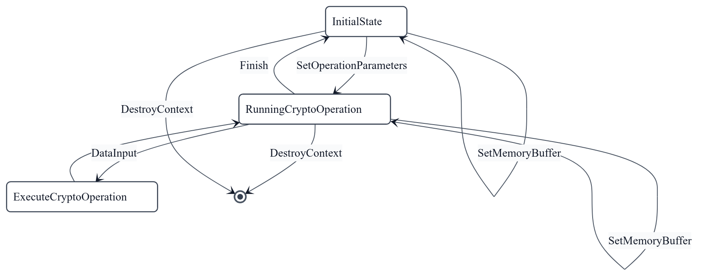
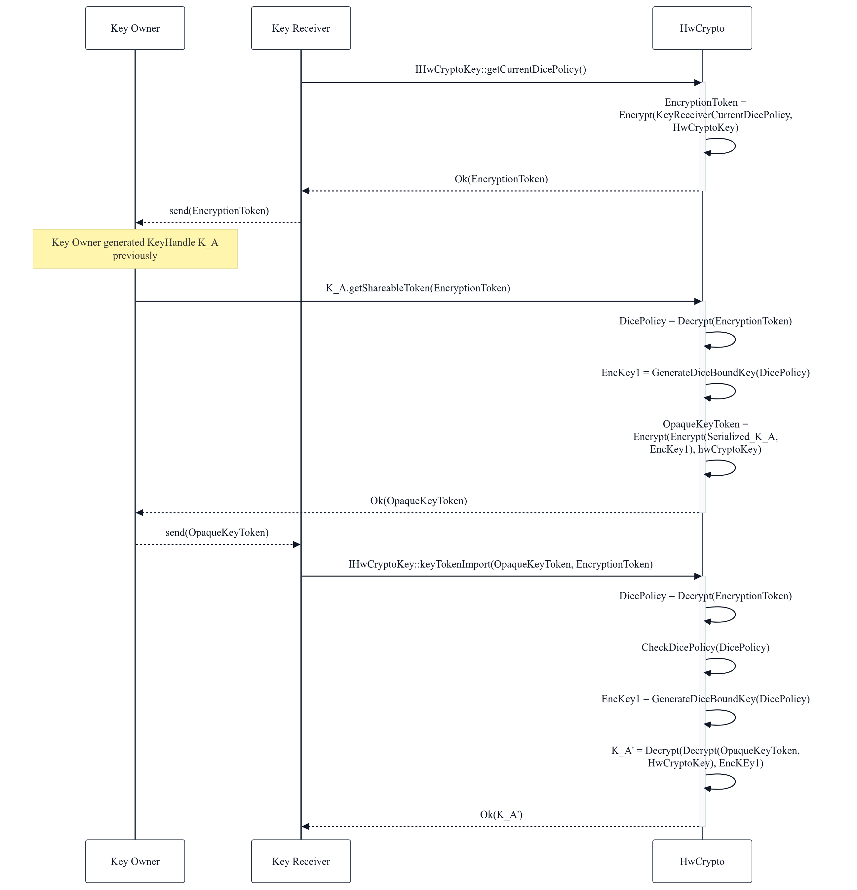

# HWCrypto Command List Interface

## Overview

The current document describes a command-based interface for all HWCrypto
cryptographic operations. This interface allows using a single IPC call to apply
a set of cryptographic operations on multiple buffers.

## Cryptographic Operations

The base of this interface is a union object named `CryptoOperation`. Using a
vector of `CryptoOperation`s, we can describe a sequence of operations that the
engine should perform for a given input. The allowed operations are defined in
[CryptoOperation.aidl](../android/hardware/security/see/hwcrypto/CryptoOperation.aidl).

Some operations are only valid in specific contexts. For example, `aadInput` is
only valid if a `setOperationParameters` operation of type
`AuthenticatedSymmetricOperation` has been issued. Additionally, implementations
are allowed to eagerly perform operations as soon as a `dataInput` operation is
received, so callers need to set up all necessary `dataOutput` operations before
this point.

### setMemoryBuffer

Operation used to set a memory buffer that can be used by other
`CryptoOperation`s. It is an optional operation because a crypto operation can
also use an immediate data buffer (a vector) directly passed as a parameter. The
definition of the arguments can be found in
[MemoryBufferParameter.aidl](../android/hardware/security/see/hwcrypto/MemoryBufferParameter.aidl).

### setOperationParameters

Operation that sets up all the parameters (e.g. key, IV, etc.) and the type of
cryptographic operation (e.g. symmetric encryption using AES, etc.) to be used.
Calls to operations that work on data, other than `copyData`, require a previous
call to `setOperationParameters`. The arguments for this call can be found in
[OperationParameters.aidl](../android/hardware/security/see/hwcrypto/OperationParameters.aidl).

### setPattern

Operation used to set a pattern while processing data. The main use case is for
symmetric decryption operations where only some portions of the data are
encrypted, and the rest is in the clear and needs to be copied to the output
buffer. Currently, the only pattern required to be supported is `cbcs` mode as
defined in ISO/IEC 23001-7:2016. The arguments for this call can be found in
[PatternParameters.aidl](../android/hardware/security/see/hwcrypto/PatternParameters.aidl).

### copyData

Operation used to copy data from the specified input buffer to a previously set
up output buffer. The arguments for this call can be found in
[OperationData.aidl](../android/hardware/security/see/hwcrypto/types/OperationData.aidl).

### aadInput

Operation used to add Additional Authenticated Data (AAD) to the operation. Once
a `dataInput` operation has been executed, no more `aadInput` operations can be
performed for that operation. `aadInput` operations are only valid if the
`setOperationParameters` operation set up an authenticated symmetric crypto
operation. The arguments for this call can be found in
[OperationData.aidl](../android/hardware/security/see/hwcrypto/types/OperationData.aidl).

### dataInput

Operation to provide an input buffer for an operation. Implementations can
eagerly execute the desired operation when this command is issued, so the client
needs to have set up all necessary output buffers beforehand (by issuing
`dataOutput` operations). The arguments for this call can be found in
[OperationData.aidl](../android/hardware/security/see/hwcrypto/types/OperationData.aidl).

### dataOutput

Operation to provide an output buffer to store the results of an operation. The
implementation will keep track of how much of the output buffer has been used,
and consecutive operations will store results in contiguous areas of the
provided output memory buffer(s). The arguments for this call can be found in
[OperationData.aidl](../android/hardware/security/see/hwcrypto/types/OperationData.aidl).

## Operation Data

Several steps use
[OperationData.aidl](../android/hardware/security/see/hwcrypto/types/OperationData.aidl)
as a parameter. These arguments allow having input or output data that can be
directly passed as a vector (`dataBuffer`) or as a reference to a previously set
memory buffer (`memoryBufferReference`).

A
[MemoryBufferReference](../android/hardware/security/see/hwcrypto/types/MemoryBufferReference.aidl)
is an (offset, size) pair that references an area inside a `MemoryBuffer`
previously set with `setMemoryBuffer` (only a single input and a single output
buffer can be active at any time).

### finish

Concludes a set of operations initiated with `setOperationParameters`. It can
produce final output data; for example, when the operation performed was a
signing operation or when performing encryption using a primitive in a mode that
requires padding. This data is stored in the output buffers previously provided
via `dataOutput`.

### destroyContext

Specifies that the current context used by the cryptographic operations should
be destroyed. This should be the last operation in a set and will prevent the
interface from returning a session context to the caller.

## Operations Context

After calling `processCommandList`, the caller receives an array of
`CryptoOperationResult`s. Each result may contain an `ICryptoOperationContext`
that can be used to continue the operations in subsequent calls (unless
`destroyContext` was issued). This context allows the caller to continue an
ongoing cryptographic operation if a `finish` operation has not been issued. The
AIDL definition for this object can be found in
[ICryptoOperationContext.aidl](../android/hardware/security/see/hwcrypto/ICryptoOperationContext.aidl).

## CryptoOperationSet

`CryptoOperation` vectors are further grouped into
[CryptoOperationSet](../android/hardware/security/see/hwcrypto/CryptoOperationSet.aidl)
parcelables. HwCrypto processes a vector of these sets. This allows the HwCrypto
service to process multiple command lists, potentially in parallel.

## Hardware Crypto Operations Interface

[IHwCryptoOperations](../android/hardware/security/see/hwcrypto/IHwCryptoOperations.aidl)
is the interface that processes the command lists via the `processCommandList`
method.

## State Machine

At a higher level, the processing of cryptographic commands can be described
using a state machine. The main states are: 1. **Initial**: No cryptographic
operation is currently set up. 2. **Operation Set**: A cryptographic operation
has been selected and initialized via `setOperationParameters`. 3. **Data
Processing**: Data is being provided and processed via `aadInput` and
`dataInput`. 4. **Finalized**: The operation has been concluded via `finish`.



## Code Sample

The following example demonstrates how to put together a command list for a
simple AES-CBC encryption:

```rust
// Setting up operation parameters
let key = hw_key.importClearKey(&aes_key_material, &policy)?;
let nonce = [0u8; 16];
let parameters = SymmetricCryptoParameters::Aes(AesCipherMode::Cbc(CipherModeParameters {
    nonce: nonce.into(),
}));

let sym_op_params = SymmetricOperationParameters {
    key: Some(key.clone()),
    direction: SymmetricOperation::ENCRYPT,
    parameters,
};

let op_params = OperationParameters::SymmetricCrypto(sym_op_params);

// Creating a command list

let mut cmd_list = Vec::<CryptoOperation>::new();

let data_output = OperationData::DataBuffer(Vec::new());

cmd_list.push(CryptoOperation::DataOutput(data_output));

cmd_list.push(CryptoOperation::SetOperationParameters(op_params));

let input_data = OperationData::DataBuffer("string to be
encrypted".as_bytes().to_vec());

cmd_list.push(CryptoOperation::DataInput(input_data));

cmd_list.push(CryptoOperation::Finish(None));

// Putting together a set of command lists containing a single one

let crypto_op_set = CryptoOperationSet { context: None, operations: cmd_list
};

let mut crypto_sets = Vec::new();

crypto_sets.push(crypto_op_set);
```

## Key Delegation Mode

Key delegation allows the creator of a key to delegate its use to a different
party. This can be used, for example, by a DRM system to create a key, restrict
its usage, and then pass it to the Android host for decryption into secure
buffers. This involves ProtectionIDs, Key Owners, and Key Token sharing.

### ProtectionID

A `ProtectionID` is an enum that describes use cases and is used to tag both
memory buffers and keys. It abstracts implementation-specific protection
methods. The `ProtectionID` is used to limit read/write operations that the
HwCrypto API can perform on behalf of the caller.

#### Write Protection

Limits the key to only use memory buffers with this `ProtectionID` as an output.

#### Read Protection

Limits the key to only use memory buffers with this `ProtectionID` as an input.

### Key Owner

The key owner is the entity that generates or imports the key. In this design, a
DICE policy represents the owner. Only the owner can set expiration timers, add
`ProtectionID`s, or export the key as a shareable token.

### Key Token Sharing

The flow to share a key between different clients is shown in the following
sequence diagram:


