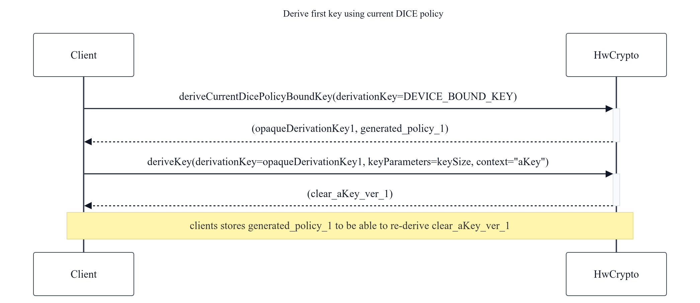
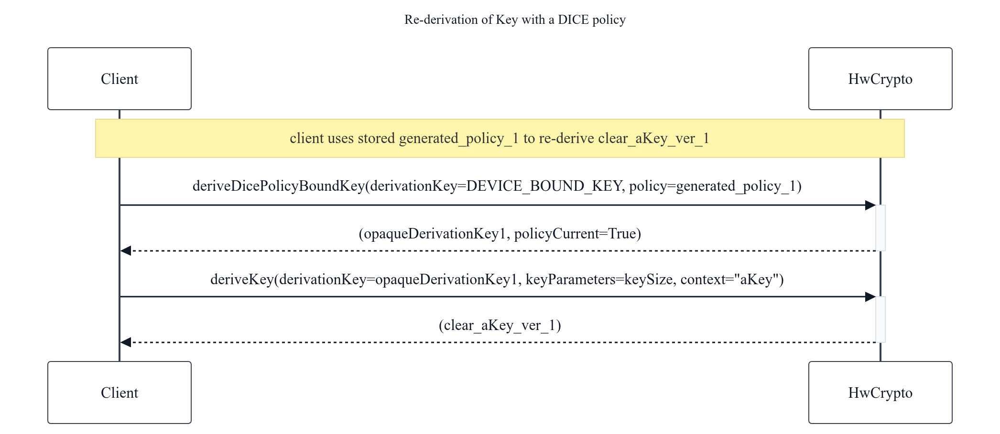
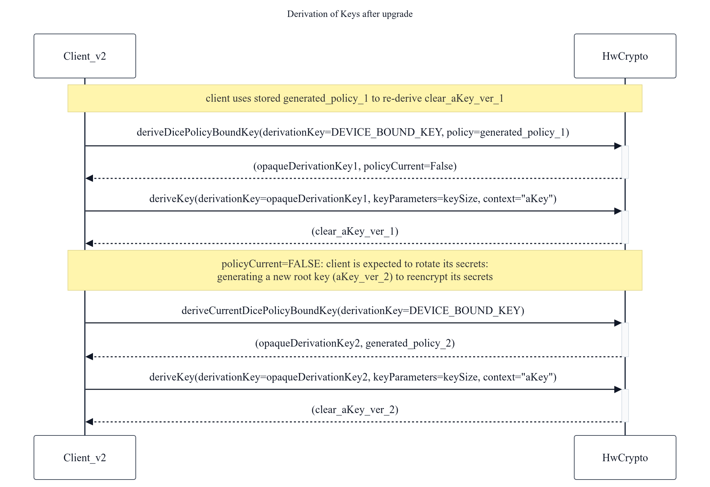

# HWCrypto DICE bound keys

The current document describes the interface to retrieve device bound keys
unique to the caller. These keys are cryptographically bound to a DICE policy
and can only be retrieved after verifying the caller's DICE chain against the
provided DICE policy.

## DICE policy

[A DICE policy](../../../../authgraph/aidl/android/hardware/security/authgraph/DicePolicy.cddl)
is a set of restrictions on a DICE chain. These restrictions can express that a
component inside a DICE chain node has a certain value, or if a numerical
version, that it is greater or equal than a given value. We use it to indicate
that a client is greater or equal than a minimum version.

## Deriving a DICE policy bound device key

A DICE policy bound key is a key unique to the caller of the API that can be
regenerated in the future by providing the same DICE policy. The API verifies
that the caller version, as defined on its DICE chain, is the same or greater
than the version required by the provided DICE policy.

Figure 1. Derive first key using current DICE policy

Figure 2. Re-derivation of key with a DICE policy

### Getting a DICE policy bound derivation key

The first step to get a DICE policy bound device key is to create a DICE policy
bound derivation key. This is a key handle that can then be used to derive any
type of HWCrypto key the caller wants to use.

The API, which can be found in
[IHwCryptoKey.aidl](../android/hardware/security/see/hwcrypto/IHwCryptoKey.aidl),
simplifies the use of DICE policy creation by providing a function that will
return the current DICE policy along with a derivation key when calling
`deriveCurrentDicePolicyBoundKey`. The caller will need to store the returned
policy to be able to derive the same key again in the future, in case an upgrade
changes any of the client version components, which would make the client's
current DICE policy different from the one used to generate the old derivation
key.

To re-generate the derivation key, the caller can provide the previously stored
DICE policy to `deriveDicePolicyBoundKey`.

The `DiceBoundDerivationKey` union allows specifying either a device-provided
key (`DEVICE_BOUND_KEY`) or an existing `IOpaqueKey` as the base for the
derivation.

### Deriving the final key

Once we have a DICE policy bound derivation key, the caller can use `deriveKey`
to produce either a clear key or a key handle. The caller provides a description
of the desired key through a `KeyPolicy`. For a clear key, the description is
simply the length of the desired key (via `ClearKeyPolicy`). For an opaque key
handle, the key type, padding, usage, and other characteristics are required.
The final derived key incorporates these fields into the key derivation
algorithm, ensuring that keys with different policies derive different key
material.

## Key Derivation Algorithm

Keys are derived using HKDF. This section describes the context parameters for
different derivations.

### Deriving a device DICE bound policy key

This is the derivation performed when calling either
`deriveCurrentDicePolicyBoundKey` or `deriveDicePolicyBoundKey` with a
device-provided key (`DEVICE_BOUND_KEY`). It produces an opaque `HMAC_SHA256`
derivation key with a hardware lifetime.

-   **Input Key:** A device-bound key (type `HMAC_SHA256`).
-   **Context:** Canonical CBOR array of two items:
    -   `0x01` (uint)
    -   Provided DICE policy (byte string)
-   **Salt:** Empty
-   **Output Length:** 32 bytes

### Deriving a DICE bound policy key from a provided opaque key

This is the derivation performed when calling either
`deriveCurrentDicePolicyBoundKey` or `deriveDicePolicyBoundKey` with an opaque
key. It produces an opaque `HMAC_SHA256` derivation key with a lifetime equal to
the provided derivation key.

-   **Input Key:** An opaque key (type `HMAC_SHA256`).
-   **Context:** Canonical CBOR array of two items:
    -   `0x02` (uint)
    -   Provided DICE policy (byte string)
-   **Salt:** Empty
-   **Output Length:** 32 bytes

### Deriving a Clear Key

This step is taken after deriving a DICE-bound key to get clear key material
that can be directly used by the caller. It is performed by `deriveKey`. Any
`HMAC_SHA256` opaque key can be used as the input derivation key.

-   **Input Key:** An `HMAC_SHA256` opaque key.
-   **Context:** Canonical CBOR array of three items:
    -   `0x03` (uint)
    -   Length of desired key (CBOR uint)
    -   Client-provided context (byte string)
-   **Salt:** Empty
-   **Output Length:** Requested key length

### Deriving an Opaque Key

This step is taken after deriving a DICE-bound key to get an opaque key that can
be used with the HwCrypto command list. It is performed by `deriveKey`. Any
`HMAC_SHA256` opaque key can be used as the input derivation key.

-   **Input Key:** An `HMAC_SHA256` opaque key.
-   **Context:** Canonical CBOR array of three items:
    -   `0x04` (uint)
    -   Client-provided context (byte string)
    -   Key policy serialized as CBOR (following `KeyPolicy.cddl`)
-   **Salt:** Empty
-   **Output Length:** Determined by the requested key type in the policy

## Rotating keys after version upgrade

After a version upgrade, any call to `deriveDicePolicyBoundKey` with an old
policy will return a signal (`dicePolicyWasCurrent = false`) to the caller. The
caller can then choose to generate a new key and re-wrap any secrets it wants to
preserve from older versions of itself.

Figure 3. Derivation of Keys after Upgrade 
